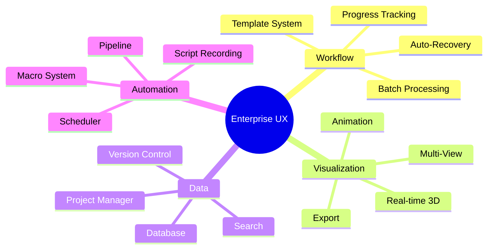

# SurfScreen: 엔터프라이즈급 표면 흡착 스크리닝 플랫폼

## 상세 설계 문서 v2.0

---

## 목차

1. [상용 소프트웨어 벤치마크](#1-상용-소프트웨어-벤치마크)
2. [사용자 편의 기능 설계](#2-사용자-편의-기능-설계)
3. [아키텍처 상세](#3-아키텍처-상세)
4. [모듈별 상세 설계](#4-모듈별-상세-설계)
5. [CLI 상세 설계](#5-cli-상세-설계)
6. [GUI 상세 설계](#6-gui-상세-설계)
7. [개발 로드맵](#7-개발-로드맵)

---

## 1. 상용 소프트웨어 벤치마크

### 1.1 분석 대상

| 소프트웨어            | 개발사          | 핵심 강점                      |
| --------------------- | --------------- | ------------------------------ |
| **Materials Studio**  | BIOVIA/Dassault | 통합 워크플로우, 직관적 GUI    |
| **Schrödinger Suite** | Schrödinger     | Maestro GUI, 자동화 워크플로우 |
| **Avogadro 2**        | Open Source     | 직관적 분자 편집기             |
| **VESTA**             | Open Source     | 결정 구조 시각화               |
| **ASE GUI**           | Open Source     | 시뮬레이션 통합                |

### 1.2 벤치마크 UX 기능



### 1.3 기능별 벤치마크

| 기능              | Materials Studio | Schrödinger    | SurfScreen 목표 |
| ----------------- | ---------------- | -------------- | --------------- |
| **분자 편집**     | 고급             | 고급 (Maestro) | ★★★★☆           |
| **표면 생성**     | 수동             | 수동           | ★★★★★ 자동화    |
| **배치 처리**     | Pipeline Pilot   | LiveDesign     | ★★★★★           |
| **프로젝트 관리** | 통합             | 통합           | ★★★★☆           |
| **스크립트**      | Python/Perl      | Python         | ★★★★★ Python    |
| **가격**          | $$$$             | $$$$           | 무료/오픈소스   |

---

## 2. 사용자 편의 기능 설계

### 2.1 Smart Workflow System

```
┌─────────────────────────────────────────────────────────────┐
│                   Smart Workflow Engine                      │
├─────────────────────────────────────────────────────────────┤
│  ┌──────────────┐                                           │
│  │   Template   │ ← 재사용 가능한 워크플로우 템플릿         │
│  │   Library    │   - Cu111_screening                       │
│  └──────────────┘   - conformer_search                      │
│         ↓            - adsorption_energy                    │
│  ┌──────────────┐                                           │
│  │   Wizard     │ ← 단계별 가이드                           │
│  │   System     │   - 초보자도 쉽게 사용                    │
│  └──────────────┘                                           │
│         ↓                                                   │
│  ┌──────────────┐                                           │
│  │   Auto       │ ← 자동 설정 제안                          │
│  │   Configure  │   - 시스템 크기별 최적 파라미터           │
│  └──────────────┘                                           │
└─────────────────────────────────────────────────────────────┘
```

### 2.2 프로젝트 관리 시스템

```python
# 프로젝트 구조 예시
project/
├── .surfscreen/              # 프로젝트 메타데이터
│   ├── config.yaml           # 프로젝트 설정
│   ├── history.db            # 작업 히스토리
│   └── cache/                # 계산 캐시
├── structures/               # 입력 구조
│   ├── surfaces/
│   └── molecules/
├── calculations/             # 계산 결과
│   ├── screening_001/
│   └── screening_002/
└── reports/                  # 분석 리포트
    └── summary.html
```

### 2.3 핵심 편의 기능

#### A. 자동 구조 감지 및 제안

```bash
$ surfscreen analyze molecule.xyz
┌─────────────────────────────────────────┐
│  🔍 Structure Analysis                   │
├─────────────────────────────────────────┤
│  Formula: C2H6O (Ethanol)               │
│  Atoms: 9                               │
│  Functional Groups: -OH (alcohol)       │
│                                          │
│  💡 Suggestions:                         │
│  • Adsorption via O atom recommended    │
│  • Optimal sites: top, hollow           │
│  • Similar molecules in DB: 3           │
└─────────────────────────────────────────┘
```

#### B. 실시간 진행률 대시보드

```
$ surfscreen screen --progress
╔═══════════════════════════════════════════════════════════╗
║  🚀 Screening Progress: Cu(111) + 50 molecules             ║
╠═══════════════════════════════════════════════════════════╣
║  ████████████████████░░░░░░░░░░  40/50 (80%)              ║
║                                                            ║
║  Current: methanol_conf_3 @ site_hollow                   ║
║  ETA: 12 min                                               ║
║                                                            ║
║  📊 Best so far: acetone (E_ads = -1.52 eV)               ║
║                                                            ║
║  [R]efresh  [P]ause  [C]ancel  [D]etails                  ║
╚═══════════════════════════════════════════════════════════╝
```

#### C. 인터랙티브 결과 탐색

```bash
$ surfscreen results explore
┌─────────────────────────────────────────────────────────────┐
│  🏆 Adsorption Energy Ranking                               │
├─────────────────────────────────────────────────────────────┤
│  1. acetone       -1.52 eV  ████████████████████           │
│  2. ethanol       -1.34 eV  ████████████████                │
│  3. methanol      -1.21 eV  ██████████████                  │
│  4. formaldehyde  -0.98 eV  ████████████                    │
│                                                              │
│  [↑/↓] Select  [Enter] View structure  [E]xport  [F]ilter  │
└─────────────────────────────────────────────────────────────┘
```

#### D. Smart Caching & Resume

```python
# 자동 체크포인트 및 재개
from surfscreen import Workflow

workflow = Workflow.load("screening_001")

# 중단된 지점부터 자동 재개
if workflow.has_checkpoint():
    print(f"Resuming from: {workflow.last_completed}")
    workflow.resume()
```

#### E. 다중 출력 포맷

```bash
$ surfscreen export --format all
✓ results.csv          # 스프레드시트
✓ results.json         # 프로그래밍
✓ report.html          # 인터랙티브 리포트
✓ structures.zip       # 모든 XYZ 파일
✓ presentation.pptx    # 발표용 (자동 생성)
```

---

## 3. 아키텍처 상세

### 3.1 계층 구조

```
┌─────────────────────────────────────────────────────────────────┐
│                         User Interface Layer                     │
│  ┌──────────────┐  ┌──────────────┐  ┌──────────────┐          │
│  │     CLI      │  │     GUI      │  │   Python     │          │
│  │   (Click)    │  │    (Qt6)     │  │     API      │          │
│  └──────┬───────┘  └──────┬───────┘  └──────┬───────┘          │
└─────────┼─────────────────┼─────────────────┼───────────────────┘
          │                 │                 │
┌─────────▼─────────────────▼─────────────────▼───────────────────┐
│                         Core Engine Layer                        │
│  ┌────────────────────────────────────────────────────────────┐ │
│  │                    Workflow Manager                         │ │
│  │  ┌──────────┐  ┌──────────┐  ┌──────────┐  ┌──────────┐   │ │
│  │  │ Template │  │Checkpoint│  │  Cache   │  │  Logger  │   │ │
│  │  └──────────┘  └──────────┘  └──────────┘  └──────────┘   │ │
│  └────────────────────────────────────────────────────────────┘ │
│                                                                  │
│  ┌──────────────┐  ┌──────────────┐  ┌──────────────┐          │
│  │  Structure   │  │ Calculation  │  │  Analysis    │          │
│  │   Builder    │  │   Engine     │  │   Engine     │          │
│  └──────────────┘  └──────────────┘  └──────────────┘          │
└─────────────────────────────────────────────────────────────────┘
          │                 │                 │
┌─────────▼─────────────────▼─────────────────▼───────────────────┐
│                         Backend Layer                            │
│  ┌────────────────────────────────────────────────────────────┐ │
│  │                   Calculator Registry                       │ │
│  │  ┌──────┐ ┌──────┐ ┌──────┐ ┌──────┐ ┌──────┐             │ │
│  │  │ MACE │ │ CP2K │ │CREST │ │ xTB  │ │Custom│             │ │
│  │  └──────┘ └──────┘ └──────┘ └──────┘ └──────┘             │ │
│  └────────────────────────────────────────────────────────────┘ │
│                                                                  │
│  ┌────────────────────────────────────────────────────────────┐ │
│  │                   Molecule Sources                          │ │
│  │  ┌──────┐ ┌────────┐ ┌──────┐ ┌────────┐                  │ │
│  │  │SMILES│ │PubChem │ │ File │ │  CSD   │                  │ │
│  │  └──────┘ └────────┘ └──────┘ └────────┘                  │ │
│  └────────────────────────────────────────────────────────────┘ │
└─────────────────────────────────────────────────────────────────┘
```

### 3.2 플러그인 시스템

```python
# 새로운 계산 엔진 추가 예시
from surfscreen.plugins import CalculatorPlugin

class MyCustomCalculator(CalculatorPlugin):
    name = "custom_dft"
    version = "1.0.0"

    def optimize(self, atoms, **kwargs):
        # 사용자 정의 최적화 로직
        pass

    def get_energy(self, atoms):
        # 에너지 계산
        pass

# 자동 등록
surfscreen.register_plugin(MyCustomCalculator)
```

---

## 4. 모듈별 상세 설계

### 4.1 MoleculeBuilder

```python
from surfscreen.molecule import MoleculeBuilder

class MoleculeBuilder:
    """분자 생성 및 관리"""

    # === 소스별 생성 ===
    @classmethod
    def from_smiles(cls, smiles: str,
                    optimize: bool = True,
                    engine: str = "rdkit") -> Molecule:
        """SMILES 문자열에서 분자 생성"""

    @classmethod
    def from_pubchem(cls,
                     cid: int = None,
                     name: str = None,
                     formula: str = None) -> Molecule:
        """PubChem에서 분자 다운로드

        Examples:
            mol = MoleculeBuilder.from_pubchem(cid=2244)
            mol = MoleculeBuilder.from_pubchem(name="aspirin")
            mol = MoleculeBuilder.from_pubchem(formula="C9H8O4")
        """

    @classmethod
    def from_file(cls, path: str,
                  format: str = "auto") -> Molecule:
        """파일에서 분자 읽기

        Supported: xyz, mol, mol2, sdf, pdb, cif, gen
        """

    # === Conformer 생성 ===
    def generate_conformers(self,
                           n_conformers: int = 10,
                           engine: str = "crest",  # rdkit, crest, xtb
                           optimize: bool = True,
                           energy_window: float = 10.0,  # kcal/mol
                           ) -> List[Molecule]:
        """다중 conformer 생성"""

    # === 분석 ===
    def get_functional_groups(self) -> List[str]:
        """작용기 감지"""

    def get_adsorption_centers(self) -> List[int]:
        """흡착 중심 원자 자동 제안"""

    def estimate_footprint(self) -> Tuple[float, float]:
        """분자 footprint 추정 (width, length)"""
```

### 4.2 SurfaceBuilder

```python
from surfscreen.surface import SurfaceBuilder

class SurfaceBuilder:
    """표면 생성 및 관리"""

    # === 벌크에서 생성 ===
    @classmethod
    def from_element(cls,
                     element: str,  # "Cu", "Au", "Pt"
                     miller_index: Tuple[int, int, int],
                     layers: int = 4,
                     vacuum: float = 15.0,
                     supercell: Tuple[int, int, int] = (1, 1, 1),
                     fixed_layers: int = 2) -> Surface:
        """원소에서 표면 생성"""

    @classmethod
    def from_structure(cls,
                       structure: Atoms,  # or path
                       miller_index: Tuple[int, int, int],
                       **kwargs) -> Surface:
        """벌크 구조에서 표면 생성"""

    @classmethod
    def from_materials_project(cls,
                               mp_id: str,
                               miller_index: Tuple[int, int, int],
                               **kwargs) -> Surface:
        """Materials Project에서 가져오기"""

    # === 표면 분석 ===
    def detect_sites(self,
                    types: List[str] = ["top", "bridge", "hollow"],
                    symm_reduce: bool = True) -> List[AdsorptionSite]:
        """흡착 사이트 자동 감지"""

    def get_surface_atoms(self) -> List[int]:
        """표면 원자 인덱스"""

    def visualize_sites(self) -> None:
        """사이트 시각화"""
```

### 4.3 AdsorptionSystem

```python
from surfscreen.adsorption import AdsorptionSystem

class AdsorptionSystem:
    """표면-분자 흡착 시스템"""

    def __init__(self, surface: Surface, molecule: Molecule):
        self.surface = surface
        self.molecule = molecule

    def generate_configurations(self,
                               sites: List[str] = ["auto"],
                               rotations: List[float] = [0, 45, 90, 135],
                               heights: List[float] = [2.0],
                               center_atoms: List[int] = None,  # auto
                               max_configs: int = 100) -> List[Atoms]:
        """흡착 구성 자동 생성"""

    def optimize_all(self,
                    calculator: Calculator,
                    parallel: bool = True,
                    n_jobs: int = -1) -> List[Result]:
        """모든 구성 최적화"""

    def get_adsorption_energy(self,
                             reference: str = "isolated"
                             ) -> float:
        """흡착 에너지 계산

        reference:
            - "isolated": E_ads = E_sys - E_surf - E_mol
            - "gas": E_ads = E_sys - E_surf - E_mol_gas
        """
```

### 4.4 CalculatorFactory

```python
from surfscreen.calculator import CalculatorFactory

class CalculatorFactory:
    """계산 엔진 팩토리"""

    @staticmethod
    def create(engine: str, **kwargs) -> Calculator:
        """
        Engines:
            - mace: MACE-MP MLIP
            - cp2k: CP2K DFT (Docker)
            - crest: CREST conformer search
            - xtb: GFN-xTB semi-empirical
        """

# 사용 예시
mace = CalculatorFactory.create(
    "mace",
    model="medium",
    device="cuda",
    dtype="float64"  # 정밀 최적화
)

cp2k = CalculatorFactory.create(
    "cp2k",
    container="docker",
    functional="PBE",
    basis_set="DZVP-MOLOPT-SR-GTH"
)

crest = CalculatorFactory.create(
    "crest",
    method="gfn2",
    threads=8,
    energy_window=6.0  # kcal/mol
)

xtb = CalculatorFactory.create(
    "xtb",
    method="gfn2",
    accuracy=1.0
)
```

---

## 5. CLI 상세 설계

### 5.1 명령 구조

```
surfscreen
├── init              # 프로젝트 초기화
├── molecule          # 분자 관련
│   ├── from-smiles
│   ├── from-pubchem
│   ├── from-file
│   ├── conformers
│   └── analyze
├── surface           # 표면 관련
│   ├── create
│   ├── from-mp
│   ├── sites
│   └── visualize
├── adsorb            # 흡착 배치
│   ├── generate
│   ├── optimize
│   └── energy
├── screen            # 대량 스크리닝
│   ├── run
│   ├── status
│   └── results
├── template          # 워크플로우 템플릿
│   ├── list
│   ├── use
│   └── create
├── config            # 설정
│   ├── show
│   ├── set
│   └── reset
└── export            # 내보내기
    ├── csv
    ├── json
    └── report
```

### 5.2 주요 명령 상세

```bash
# ===== 프로젝트 초기화 =====
$ surfscreen init catalyst-screening
🚀 Creating project: catalyst-screening
   ✓ Created .surfscreen/config.yaml
   ✓ Created structures/
   ✓ Created calculations/
   ✓ Created reports/

# ===== 분자 명령 =====
$ surfscreen molecule from-pubchem 2244 --output aspirin.xyz
📦 Fetching from PubChem: CID 2244 (Aspirin)
   ✓ Downloaded: aspirin.xyz
   ✓ Formula: C9H8O4
   ✓ Atoms: 21

$ surfscreen molecule conformers aspirin.xyz \
    --engine crest \
    --n-conformers 20 \
    --energy-window 6
🔄 Generating conformers with CREST...
   ✓ Found 15 unique conformers
   ✓ Energy range: 0.0 - 4.2 kcal/mol
   ✓ Saved to: conformers/aspirin_*.xyz

$ surfscreen molecule analyze aspirin.xyz
🔍 Structure Analysis: Aspirin (C9H8O4)
   • Functional groups: carboxyl (-COOH), ester (-COO-)
   • Adsorption centers: O1, O2, O3, O4
   • Suggested sites: top (via O), hollow (via ring)
   • Molecular footprint: 7.2 × 4.8 Å

# ===== 표면 명령 =====
$ surfscreen surface create Pt \
    --miller 111 \
    --layers 4 \
    --supercell 4x4x1 \
    --vacuum 15 \
    --fix-bottom 2
🏗️ Creating Pt(111) surface...
   ✓ Layers: 4 (bottom 2 fixed)
   ✓ Supercell: 4×4×1
   ✓ Atoms: 64
   ✓ Cell: 11.1 × 9.6 × 35.0 Å
   ✓ Saved to: surfaces/Pt111_4x4.xyz

$ surfscreen surface sites Pt111_4x4.xyz --show
📍 Detected adsorption sites:
   • top: 16 sites
   • bridge: 24 sites
   • fcc: 16 sites (hollow)
   • hcp: 16 sites (hollow)
   Total: 72 unique sites

# ===== 흡착 명령 =====
$ surfscreen adsorb generate \
    --surface Pt111_4x4.xyz \
    --molecule aspirin.xyz \
    --sites auto \
    --rotations 0,45,90,135 \
    --height 2.0 \
    --max-configs 50
🎯 Generating adsorption configurations...
   ✓ Surface sites: 72
   ✓ Molecule centers: 4 (O atoms)
   ✓ Rotations: 4
   ✓ Generated: 50 configurations (filtered by overlap)
   ✓ Saved to: configurations/Pt111_aspirin_*.xyz

# ===== 스크리닝 명령 =====
$ surfscreen screen run \
    --surface surfaces/Pt111.xyz \
    --molecules "molecules/*.xyz" \
    --engine mace \
    --model medium \
    --device cuda \
    --parallel 4 \
    --checkpoint
🚀 Starting screening...
   Surface: Pt(111) 4×4
   Molecules: 25 files
   Engine: MACE (medium)

   ████████████████████░░░░░░░░░░  60% (15/25)
   Current: benzene_conf_2 @ fcc_site
   ETA: 8 min

   Best so far: pyridine (E_ads = -1.82 eV)

$ surfscreen screen results --sort e_ads --top 10
🏆 Top 10 Adsorption Results
┌────┬───────────────┬──────────┬────────┬───────────┐
│ #  │ Molecule      │ Site     │ E_ads  │ d(M-surf) │
├────┼───────────────┼──────────┼────────┼───────────┤
│ 1  │ pyridine      │ fcc      │ -1.82  │ 2.15 Å    │
│ 2  │ benzene       │ hcp      │ -1.65  │ 2.21 Å    │
│ 3  │ aspirin_c3    │ top_O1   │ -1.58  │ 2.08 Å    │
│ 4  │ ethanol       │ top_O    │ -1.34  │ 2.12 Å    │
│ ...│ ...           │ ...      │ ...    │ ...       │
└────┴───────────────┴──────────┴────────┴───────────┘

# ===== 내보내기 =====
$ surfscreen export report --format html --interactive
📊 Generating interactive report...
   ✓ Created: reports/screening_report.html
   ✓ Includes: 3D viewer, energy chart, ranking table
```

### 5.3 설정 파일

```yaml
# .surfscreen/config.yaml
project:
  name: "catalyst-screening"
  author: "User"
  created: "2026-01-29"

defaults:
  calculator:
    engine: mace
    model: medium
    device: cuda

  surface:
    vacuum: 15.0
    fixed_layers: 2

  screening:
    parallel: true
    n_jobs: 4
    checkpoint: true

  export:
    formats: [csv, json, html]

paths:
  structures: structures/
  calculations: calculations/
  reports: reports/
  cache: .surfscreen/cache/

engines:
  cp2k:
    container: docker
    image: cp2k/cp2k:latest
  crest:
    path: /usr/local/bin/crest
  xtb:
    path: /usr/local/bin/xtb
```

---

## 6. GUI 상세 설계

### 6.1 메인 윈도우 레이아웃

```
┌─────────────────────────────────────────────────────────────────────┐
│  File  Edit  View  Structure  Calculate  Tools  Help                │
├─────────────────────────────────────────────────────────────────────┤
│  [New] [Open] [Save] │ [Undo] [Redo] │ [Run] [Stop] │ [View3D]     │
├───────────────┬───────────────────────────────────────┬─────────────┤
│               │                                        │             │
│   Project     │          3D Viewer / Editor           │  Properties │
│   Explorer    │                                        │             │
│               │    ┌───────────────────────────┐      │  ─────────  │
│  📁 Project   │    │                           │      │  Atom: Cu   │
│  ├─📁surfaces │    │      [3D Molecular        │      │  Pos: ...   │
│  │  └Cu111.xyz│    │       Visualization]      │      │             │
│  ├─📁molecules│    │                           │      │  ─────────  │
│  │  └─*.xyz   │    │                           │      │  Selection: │
│  └─📁calcs    │    └───────────────────────────┘      │  12 atoms   │
│               │                                        │             │
│               │  ─────────────────────────────────────│─────────────│
│               │  [Rotate] [Pan] [Zoom] │ [Select] [Add] [Delete]   │
├───────────────┴───────────────────────────────────────┴─────────────┤
│  📊 Jobs: 2 running  │  💾 Memory: 4.2 GB  │  🖥️ GPU: 85%           │
└─────────────────────────────────────────────────────────────────────┘
```

### 6.2 3D 뷰어 기능 (Avogadro 수준)

| 기능           | 설명                                |
| -------------- | ----------------------------------- |
| **원자 조작**  | 추가, 삭제, 이동, 복사              |
| **결합 편집**  | 결합 추가/삭제, 결합 차수 변경      |
| **측정**       | 거리, 각도, 이면각 측정             |
| **선택 도구**  | 개별, 영역, 원소별, SMARTS 패턴     |
| **표현 방식**  | Ball-Stick, CPK, Wireframe, Surface |
| **색상 체계**  | 원소별, 전하, 에너지, 사용자 정의   |
| **애니메이션** | 최적화 경로, MD 트라젝토리          |
| **내보내기**   | PNG, SVG, GIF, MP4                  |

### 6.3 워크플로우 위자드

```
┌─────────────────────────────────────────────────────────────────┐
│  🧙 Screening Wizard                                   Step 2/5  │
├─────────────────────────────────────────────────────────────────┤
│                                                                  │
│  Select Surface Type                                            │
│  ─────────────────                                               │
│                                                                  │
│  ○ FCC Metals                                                   │
│     [Cu] [Ag] [Au] [Pd] [Pt] [Ni]                              │
│                                                                  │
│  ○ BCC Metals                                                   │
│     [Fe] [W] [Mo]                                               │
│                                                                  │
│  ○ Custom Structure                                             │
│     [Browse...]                                                  │
│                                                                  │
│  Miller Index: [(1) (1) (1)]  Layers: [4]                       │
│                                                                  │
│  Preview:                                                        │
│  ┌─────────────────────┐                                        │
│  │   [3D Preview]      │  Atoms: 64                             │
│  │                     │  Cell: 10.2 × 10.2 Å                   │
│  └─────────────────────┘                                        │
│                                                                  │
├─────────────────────────────────────────────────────────────────┤
│                              [◀ Back]  [Next ▶]  [Cancel]       │
└─────────────────────────────────────────────────────────────────┘
```

---

## 7. 개발 로드맵

### 7.1 Phase 1: Core Library (Week 1-2)

| 태스크                           | 우선순위  | 예상 시간 |
| -------------------------------- | --------- | --------- |
| `surfscreen.molecule.builder`    | 🔴 High   | 4h        |
| `surfscreen.molecule.pubchem`    | 🔴 High   | 2h        |
| `surfscreen.molecule.conformers` | 🟡 Medium | 4h        |
| `surfscreen.surface.builder`     | 🔴 High   | 6h        |
| `surfscreen.surface.sites`       | 🔴 High   | 4h        |
| `surfscreen.adsorption`          | 🔴 High   | 6h        |
| `surfscreen.calculator.mace`     | 🔴 High   | 4h        |
| `surfscreen.calculator.xtb`      | 🟡 Medium | 3h        |
| `surfscreen.calculator.crest`    | 🟡 Medium | 3h        |
| `surfscreen.calculator.cp2k`     | 🟢 Low    | 4h        |
| Unit tests                       | 🔴 High   | 8h        |

### 7.2 Phase 2: CLI (Week 3)

| 태스크                   | 우선순위  | 예상 시간 |
| ------------------------ | --------- | --------- |
| CLI 프레임워크 (Click)   | 🔴 High   | 2h        |
| `molecule` 명령 그룹     | 🔴 High   | 4h        |
| `surface` 명령 그룹      | 🔴 High   | 4h        |
| `adsorb` 명령 그룹       | 🔴 High   | 4h        |
| `screen` 명령 그룹       | 🔴 High   | 6h        |
| `template` 명령 그룹     | 🟡 Medium | 3h        |
| `export` 명령 그룹       | 🟡 Medium | 3h        |
| Progress bar & Dashboard | 🟡 Medium | 4h        |
| 자동완성 & 도움말        | 🟢 Low    | 2h        |

### 7.3 Phase 3: 고급 기능 (Week 4)

| 태스크                      | 우선순위  | 예상 시간 |
| --------------------------- | --------- | --------- |
| 워크플로우 템플릿 시스템    | 🟡 Medium | 6h        |
| 체크포인트 & 재개           | 🔴 High   | 4h        |
| 병렬 처리 (multiprocessing) | 🔴 High   | 4h        |
| 캐싱 시스템                 | 🟡 Medium | 4h        |
| 결과 분석 & 시각화          | 🟡 Medium | 6h        |
| HTML 리포트 생성            | 🟢 Low    | 4h        |

### 7.4 Phase 4: GUI (Week 5-7)

| 태스크                | 우선순위  | 예상 시간 |
| --------------------- | --------- | --------- |
| Qt6/PySide6 설정      | 🔴 High   | 2h        |
| 메인 윈도우 레이아웃  | 🔴 High   | 6h        |
| 프로젝트 탐색기       | 🔴 High   | 4h        |
| 3D 뷰어 (VTK/PyVista) | 🔴 High   | 12h       |
| 분자 편집기           | 🔴 High   | 16h       |
| 속성 패널             | 🟡 Medium | 4h        |
| 워크플로우 위자드     | 🟡 Medium | 8h        |
| 작업 관리자           | 🟡 Medium | 6h        |
| 결과 분석 뷰어        | 🟡 Medium | 6h        |
| 테마 & 커스터마이징   | 🟢 Low    | 4h        |

---

## 8. 의존성

```toml
# pyproject.toml
[project]
name = "surfscreen"
version = "0.1.0"
requires-python = ">=3.9"

dependencies = [
    # Core
    "numpy>=1.24",
    "scipy>=1.10",
    "ase>=3.22",
    "pymatgen>=2023.0",

    # Molecule
    "rdkit>=2023.0",
    "requests>=2.28",  # PubChem

    # CLI
    "click>=8.1",
    "rich>=13.0",  # Rich console output
    "typer>=0.9",  # Optional enhanced CLI

    # Calculation
    "mace-torch>=0.3",
    "torch>=2.0",

    # GUI (optional)
    "PySide6>=6.5",
    "pyvista>=0.40",
    "vtk>=9.2",

    # Analysis
    "pandas>=2.0",
    "plotly>=5.15",
    "jinja2>=3.1",  # Reports
]
```

---

## 9. 결론

SurfScreen은 다음을 통해 엔터프라이즈급 UX를 제공합니다:

1. **자동화**: 구조 생성, 사이트 감지, 배치 생성 자동화
2. **직관성**: CLI 위자드, GUI 편집기, 실시간 피드백
3. **확장성**: 플러그인 시스템, 사용자 정의 계산 엔진
4. **생산성**: 템플릿, 체크포인트, 병렬 처리
5. **분석**: 인터랙티브 결과 탐색, 자동 리포트 생성

개발 시작: Phase 1 Core Library
